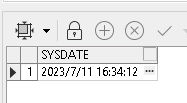

- oracle获取系统当前时间有两种： 一种是 date 类型，一种是 timestamp 类型

```sql
select sysdate from dual
```

```sql
select systimestamp from dual
```


------------


- date 和 timestamp  转 字符串

```sql
select to_char(sysdate,'YYYY-MM-DD HH24:MI:SS') from dual
select to_char(systimestamp,'YYYY-MM-DD HH24:MI:SS') from dual
```


------------


- timestamp 类型可以精确到 毫秒 微秒 纳秒

```sql
SELECT TO_CHAR(SYSTIMESTAMP, 'yyyymmddhhmmss') A,
       TO_CHAR(SYSTIMESTAMP, 'yyyymmddhhmmssff3') B,
       TO_CHAR(SYSTIMESTAMP, 'yyyymmddhhmmssff6') C,
       TO_CHAR(SYSTIMESTAMP, 'yyyymmddhhmmssff') D,
       TO_CHAR(SYSTIMESTAMP, 'yyyymmddhhmmssff9') E
  FROM DUAL
```


------------


- 字符串 转 date 和 timestamp

```sql
// 它们是等价的
SELECT TO_DATE('2022-05-18 09:38:47', 'YYYY-MM-DD HH24:MI:SS') TESTTIME FROM DUAL
SELECT TO_DATE('2022-5-18 09:38:47', 'YYYY-MM-DD HH24:MI:SS') TESTTIME FROM DUAL
SELECT TO_DATE('2022/05/18 09:38:47', 'YYYY-MM-DD HH24:MI:SS') TESTTIME FROM DUAL
SELECT TO_DATE('2022/5/18 09:38:47', 'YYYY-MM-DD HH24:MI:SS') TESTTIME FROM DUAL
```


------------


- date 和 number 运算：

```sql
// DATE 加一天
SELECT SYSDATE + 1 FROM DUAL
select sysdate, sysdate + numtodsinterval(1, 'day') from dual

// DATE 加十分钟
SELECT SYSDATE + 10/1440 FROM DUAL
select sysdate, sysdate + numtodsinterval(10, 'minute') from dual

// DATE 加一个月
SELECT ADD_MONTHS(SYSDATE, +1) FROM DUAL
select sysdate, sysdate + numtoyminterval(1, 'month') from dual

numtodsinterval 加的是 时分秒
numtoyminterval 加的是 年月日
```
```sql
// 结果是天数
SELECT TO_DATE('2022/5/19 20:38:47', 'YYYY-MM-DD HH24:MI:SS') -
       TO_DATE('2022/5/18 19:38:47', 'YYYY-MM-DD HH24:MI:SS')
  FROM DUAL

// 结果是分钟
SELECT (TO_DATE('2022/5/19 20:38:47', 'YYYY-MM-DD HH24:MI:SS') -
       TO_DATE('2022/5/18 19:38:47', 'YYYY-MM-DD HH24:MI:SS')) * 24 * 60
  FROM DUAL
```

------------

- timestamp 和 number 运算：

```sql
// 前一天
select TO_CHAR(SYSTIMESTAMP - INTERVAL '1' DAY,'YYYY-MM-DD hh24:mi:ss:ff6') from dual
```

------------


```sql
// 将 12分钟 转化为 时：分：秒
SELECT TO_CHAR(TRUNC(minutes / 60), 'FM990') || ':' ||
       TO_CHAR(MOD(minutes, 60), 'FM00') || ':' ||
       TO_CHAR(MOD(minutes * 60, 60), 'FM00')
FROM (SELECT 12 AS minutes FROM DUAL)
```


