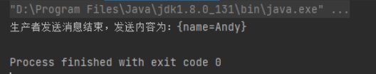
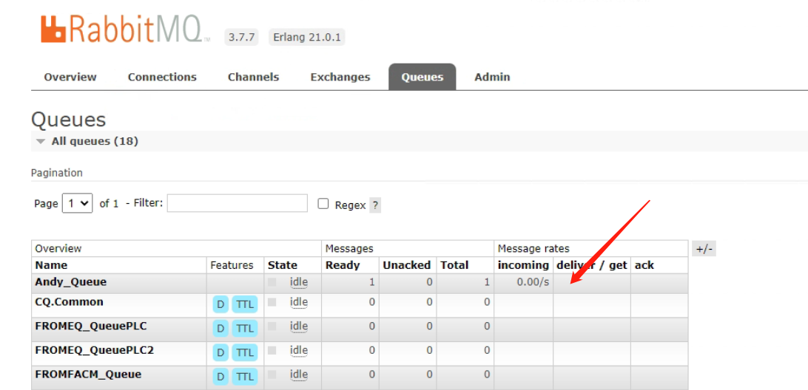
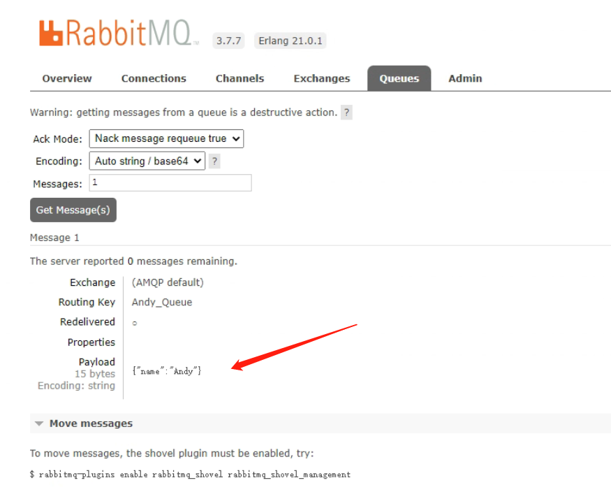
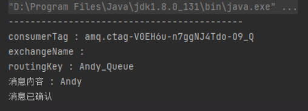
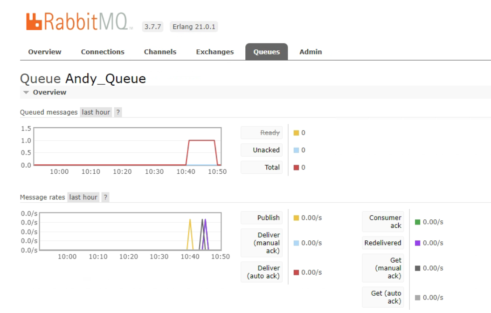
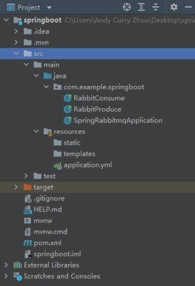

> HelloWorld

------------

```xml
新建springboot pom导入依赖：

<dependency>
    <groupId>org.springframework.boot</groupId>
    <artifactId>spring-boot-starter-amqp</artifactId>
</dependency>
<dependency>
    <groupId>org.springframework.boot</groupId>
    <artifactId>spring-boot-starter-web</artifactId>
</dependency>

<dependency>
    <groupId>org.springframework.boot</groupId>
    <artifactId>spring-boot-starter-test</artifactId>
    <scope>test</scope>
</dependency>
<dependency>
    <groupId>org.springframework.amqp</groupId>
    <artifactId>spring-rabbit-test</artifactId>
    <scope>test</scope>
</dependency>
<dependency>
    <groupId>org.projectlombok</groupId>
    <artifactId>lombok</artifactId>
</dependency>
<dependency>
    <groupId>com.alibaba</groupId>
    <artifactId>fastjson</artifactId>
    <version>2.0.5</version>
</dependency>
```
```java
生产者 RabbitProduce.java

package com.example.springboot;

import com.alibaba.fastjson.JSON;
import com.rabbitmq.client.Channel;
import com.rabbitmq.client.Connection;
import com.rabbitmq.client.ConnectionFactory;

import java.io.IOException;
import java.util.HashMap;
import java.util.Map;
import java.util.concurrent.TimeoutException;


public class RabbitProduce {

    // 设置队列名
    public static final String QUEUE_NAME = "Andy_Queue";

    public void producer() throws IOException, TimeoutException {
        // 创建连接工厂
        ConnectionFactory connectionFactory = new ConnectionFactory();
		
        // 连接到本地server
        connectionFactory.setHost("127.0.0.1");
		
        // 通过连接工厂创建连接
        Connection connection = connectionFactory.newConnection();
		
        // 通过连接创建通道
        Channel channel = connection.createChannel();
		
        // 创建一个名为Andy的队列，该队列非持久(RabbitMQ重启后会消失)、非独占(非仅用于此链接)、非自动删除(服务器将不再使用的队列删除)
        channel.queueDeclare(QUEUE_NAME, false, false, false, null);

        Map<String, String> map = new HashMap<>();
        map.put("name", "Andy");
        // 发布消息
        // 四个参数为：指定路由器，指定key，指定参数，数据内容
        channel.basicPublish("", QUEUE_NAME, null, JSON.toJSONBytes(map));

        System.out.println("生产者发送消息结束，发送内容为：" + map);
        channel.close();
        connection.close();
    }

    public static void main(String[] args) throws IOException, TimeoutException {
        RabbitProduce producer = new RabbitProduce();
        producer.producer();
    }
}


```
运行produce：


打开rabbitmq web管理界面：http://localhost:15672/#/queues



```java
消费者 RabbitConsume.java

package com.example.springboot;

import com.alibaba.fastjson.JSONObject;
import com.rabbitmq.client.*;

import java.io.IOException;
import java.nio.charset.StandardCharsets;
import java.util.concurrent.TimeoutException;

public class RabbitConsume {

    public void consumer() throws IOException, TimeoutException {
        // 创建连接工厂
        ConnectionFactory connectionFactory = new ConnectionFactory();
        // 连接到本地server
        connectionFactory.setHost("127.0.0.1");
        // 通过连接工厂创建连接
        Connection connection = connectionFactory.newConnection();
        // 通过连接创建通道
        Channel channel = connection.createChannel();
        // 创建消费者，阻塞接收消息
        com.rabbitmq.client.Consumer consumer = new DefaultConsumer(channel) {
            @Override
            public void handleDelivery(String consumerTag, Envelope envelope, AMQP.BasicProperties properties, byte[] body) throws IOException {
                System.out.println("-------------------------------------------");
                System.out.println("consumerTag : " + consumerTag);
                System.out.println("exchangeName : " + envelope.getExchange());
                System.out.println("routingKey : " + envelope.getRoutingKey());
                String msg = new String(body, StandardCharsets.UTF_8);
                JSONObject obj = JSONObject.parseObject(msg);

                System.out.println("消息内容 : " + obj.getString("name"));

                // 消息确认
                channel.basicAck(envelope.getDeliveryTag(), false);
                System.out.println("消息已确认");
            }
        };
        // 启动消费者消费指定队列
        channel.basicConsume(RabbitProduce.QUEUE_NAME, consumer);
//        channel.close();
//        connection.close();
    }

    public static void main(String[] args) throws IOException, TimeoutException {
        RabbitConsume consumer = new RabbitConsume();
        consumer.consumer();
    }
}


```
运行consume：


消息被consume消费了：


```java
SpringRabbitmqApplication.java

package com.example.springboot;

import org.springframework.boot.SpringApplication;

public class SpringRabbitmqApplication {
    public static void main(String[] args){
        SpringApplication.run(SpringRabbitmqApplication.class,args);
    }
}

```

```java
application.yml

spring:
  rabbitmq:
    addresses: 127.0.0.1
    host: 5672
    username: guest
    password: guest
    virtual-host: /
    listener:
      simple:
        acknowledge-mode: manual

```



