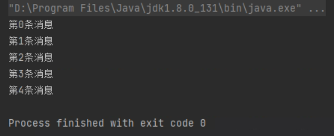
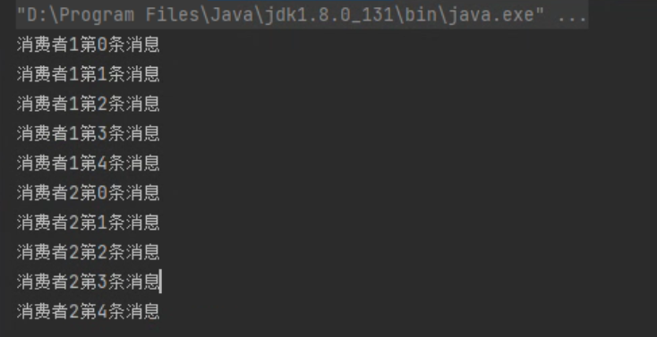

> 交换机类型1：消息订阅发布（Fanout）

------------

生产者声明交换机：Andy_EXCHANGE（不再声明Queue了，直接将消息发送到交换机）
```java
生产者：

package com.example.springboot;

import com.rabbitmq.client.Channel;
import com.rabbitmq.client.Connection;
import com.rabbitmq.client.ConnectionFactory;

import java.io.IOException;
import java.util.concurrent.TimeoutException;

public class RabbitProduce {


    public static final String EXCHANGE_NAME = "Andy_EXCHANGE";

    public void producer() throws IOException, TimeoutException {

        ConnectionFactory connectionFactory = new ConnectionFactory();

        connectionFactory.setHost("127.0.0.1");

        Connection connection = connectionFactory.newConnection();

        Channel channel = connection.createChannel();

        channel.exchangeDeclare(EXCHANGE_NAME, "fanout");

        for (int i = 0; i < 5; i++) {
            String msg = "第" + i + "条消息";
            channel.basicPublish(EXCHANGE_NAME, "", null, msg.getBytes());
            System.out.println(msg);
        }
        
        channel.close();
        connection.close();
    }

    public static void main(String[] args) throws IOException, TimeoutException {
        RabbitProduce producer = new RabbitProduce();
        producer.producer();
    }
}


```


```java
消费者1：

package com.example.springboot;

import com.rabbitmq.client.*;

import java.io.IOException;
import java.nio.charset.StandardCharsets;
import java.util.concurrent.TimeoutException;

public class RabbitConsumeOne {
    public static final String QUEUE_NAME = "Andy_QUEUE_ONE";

    public void consumer() throws IOException, TimeoutException {

        ConnectionFactory connectionFactory = new ConnectionFactory();

        connectionFactory.setHost("127.0.0.1");

        Connection connection = connectionFactory.newConnection();

        Channel channel = connection.createChannel();

        channel.queueDeclare(QUEUE_NAME, false, false, false, null);

        channel.queueBind(QUEUE_NAME, RabbitProduce.EXCHANGE_NAME, "");

        com.rabbitmq.client.Consumer consumer = new DefaultConsumer(channel) {
            @Override
            public void handleDelivery(String consumerTag, Envelope envelope, AMQP.BasicProperties properties, byte[] body) throws IOException {
                String msg = new String(body, StandardCharsets.UTF_8);
                System.out.println("消费者1" + msg);
            }
        };
        channel.basicConsume(QUEUE_NAME, true, consumer);
    }

}

```
```java
消费者2：

package com.example.springboot;

import com.rabbitmq.client.*;

import java.io.IOException;
import java.nio.charset.StandardCharsets;
import java.util.concurrent.TimeoutException;

public class RabbitConsumeTwo {
    public static final String QUEUE_NAME = "Andy_QUEUE_TWO";

    public void consumer() throws IOException, TimeoutException {

        ConnectionFactory connectionFactory = new ConnectionFactory();

        connectionFactory.setHost("127.0.0.1");

        Connection connection = connectionFactory.newConnection();

        Channel channel = connection.createChannel();

        channel.queueDeclare(QUEUE_NAME, false, false, false, null);

        channel.queueBind(QUEUE_NAME, RabbitProduce.EXCHANGE_NAME, "");

        com.rabbitmq.client.Consumer consumer = new DefaultConsumer(channel) {
            @Override
            public void handleDelivery(String consumerTag, Envelope envelope, AMQP.BasicProperties properties, byte[] body) throws IOException {
                String msg = new String(body, StandardCharsets.UTF_8);
                System.out.println("消费者2" + msg);
            }
        };
        channel.basicConsume(QUEUE_NAME, true, consumer);
    }

}

```
```java
启动消费：

package com.example.springboot;

import java.io.IOException;
import java.util.concurrent.TimeoutException;

public class FinalConsume {
    public static void main(String[] args) throws IOException, TimeoutException {
        RabbitConsumeOne consumeOne = new RabbitConsumeOne();
        RabbitConsumeTwo consumeTwo = new RabbitConsumeTwo();

        consumeOne.consumer();
        consumeTwo.consumer();

    }
}

```


